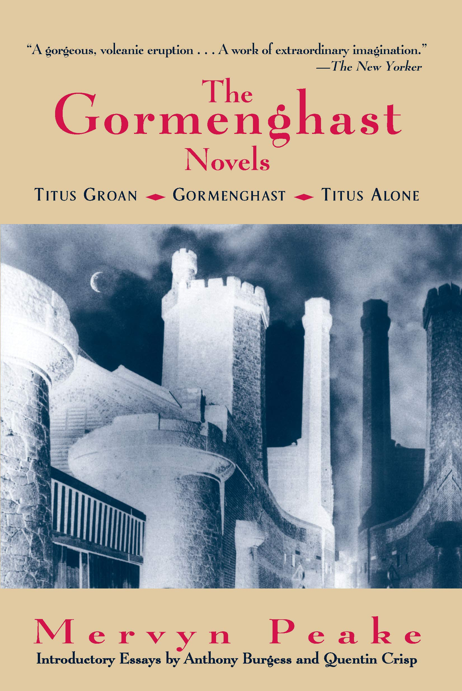

[ ] Expand notes into full sentences

### About *Gormenghast*

<figcaption>
Cover of the <i>The Gormenghast Novels</i>, 1995. Overlook Press.
</figcaption>

* Author
  * Biography and history
* Book
  * Publication history
  * Demonstrate ongoing influence and interest

### Why did we select this novel?

* Intuitively, Peake uses an extended vocabulary related to colour/light/visual impressions.

[ ] Include numerical evidence for lexical diversity in *Gormenghast*

### Place in *Gormenghast*

* Imaginative, aim to create a place that is novel/deep etc.
* Lesser-Woods.[^1]

[^1]: Lesser Woods, Imogen Helen Louise. “The Literary Spaces of Mervyn Peake’s the Gormenghast Trilogy Used as a Foundation for Architectural Exploration.” In *Writing Spaces*, 155–64. Leiden: Brill, 2019. https://doi.org/10/dsfj.

