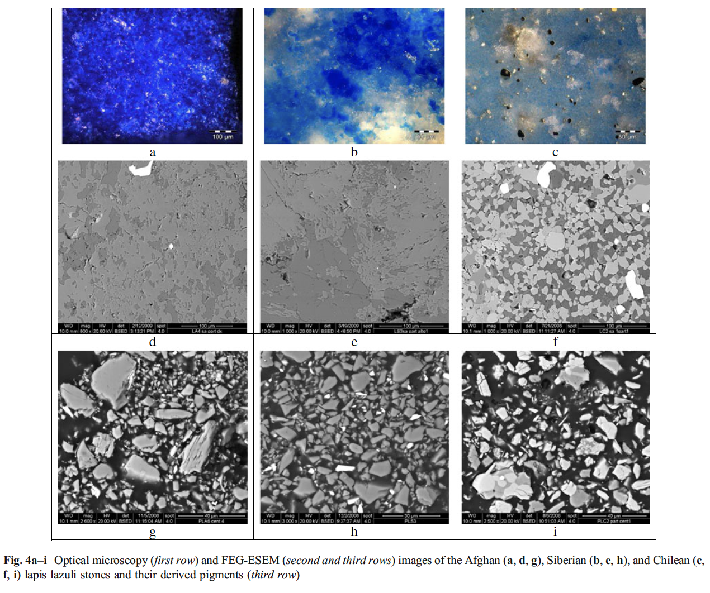

Potential cross references: color vision, [[portrait.taxon.bee]], etc.

[The Karner Blue Butterfly](https://modernconservationist.com/forgotten-endangered-species-karner-blue-butterfly/)

[Blue Dunes on the Red Planet](https://www.nasa.gov/image-feature/blue-dunes-on-the-red-planet) Image Credit: NASA/JPL-Caltech/ASU

>A sea of dark dunes, sculpted by the wind into long lines, surrounds Mars' northern polar cap and covers an area as big as Texas. In this false-color image, areas with cooler temperatures are recorded in bluer tints, while warmer features are depicted in yellows and oranges.

[The Blue Marble](https://visibleearth.nasa.gov/images/2181/the-blue-marble/2182l)

>Using a collection of satellite images and data, scientists and visualizers stitched together months of observations of Earth’s land surface, oceans, sea ice, and clouds into a seamless, true-color mosaic.

## Natural History of Blue

Iridescence changing with the angle of light.

Phylogeny of the genus Morpho, showing the right wings of males and females. U = Understory and C = Canopy.

Why are _Morpho_ butterflies blue?
Why are some _Morpho_ not blue?

>- Debat, Vincent, Serge Berthier, Patrick Blandin, Nicolas Chazot, Marianne Elias, Doris Gomez, and Violaine Llaurens. “Why Are Morpho Blue?” In _Biodiversity and Evolution_, edited by Philippe Grandcolas and Marie-Christine Maurel, 139–74. Elsevier, 2018.
>Color diversity in animals is often discussed in terms of signals received by predators and/or sexual partners or competitors. Butterfly coloration is therefore generally considered first and foremost as a visual signal, both on an inter- and intra-specific level. Other selective pressures act on coloration: butterfly wing scales are also involved in thermoregulation and hydrophobia.

>Despite their iconic status, Morpho remain relatively unknown especially for the evolution of their coloration. While their phylogeny is well established and the nano-structural basis of their color fully identified, the ecological and genetic factors of these traits are almost entirely unexplored. The hypotheses commonly called upon to explain the evolution of the iridescent blue color, whether in terms of sexual selection or escape from predators, have never been explicitly tested. These gaps leave us with a number of open questions: are non-blue species subject to different selective pressures (thermoregulation, hydrophobia, predation, communication)? Do they fly more slowly or simply in a different way than their blue relatives? Are there, within each species, differences in flight behavior between sexes? In the hypothesis regarding the importance of blue as a sexual signal, do Morpho show evidence of particular visual receptors? Are they sensitive to polarized light? All of these questions require experiments to be carried out that would allow us to study flight modalities and numerous behavioral traits. But they point above all, despite more than a century of collecting, toward the lack of understanding of the ecology of Morpho.

## Cultural History of Blue

Blues history is rich with equivocal conjecture.

In Homer’s Odyssey, there are many references to white and black, essentially the albedo scale, in order to describe place and their objects. Reference to colour barely occurs, only in smatterings of red and yellow but with no mention of blue. Similar to the linguistic trend that philologist Lazarus Geiger, and theorist Berlin and Kay also recognise in human cultures across the globe. Blue has been attributed an array of meanings from wealth to Mother Mary’s purity to the police to everyday blue collar workers and the bibliothèque bleue (blue library), as well as the crass blue slang and blue boys to name a few.

>“Blue: as yellow is always accompanied with light, so it may be said that blue still brings a principle of darkness with it. This color has a peculiar and almost indescribable effect on the eye. As a hue it is powerful - but it is on the negative side, and in its highest purity is, as it were, a stimulating negation. Its appearance, then, is a kind of contradiction between excitement and repose.” 
>- Goethe, Johann Wolfgan von. _Theory of Colours_, 1810.

The deep and void-like quality desired by Yves Kleins synthetic version of ultramarine is similar to blues  principle of darkness that Goethe describes. The vacuousness of this pigment is potentially due to the ways that synthetic blue lattice is formed, which is much more unified than its naturally occurring ultramarine counterpart (Farvaro, et al.). Ultramarine is the purified pigment from the semi-precious gemstone, lapis lazuli, and has been used in the 14th and 17th centuries paintings as a representation of wealth and power. Lapis lazuli serves a symbolic function representing the contradictions in political assemblages and trade agreements, since it is a resource that has continually been the grounds conflict and exploitation. It is at once an isolated resource, only existing in eleven known depositories around the globe, as well as one that has been identified in places all over the world since 38,000BC (Pister 45).

>- Favaro, M. A. Guastoni, F. Marini, S. Bianchi, A. Gambirasi. "Characterisation of lapis lazuli and corresponding purified pigments for a provenance study of ultramarine pigments used in works of art". Published online, 29 December 2011.
>- Pister, Patricia. "Deep Blue Geomeditations : Following Lapis Lazuli in Three Ecological Assemblages". SubStance, Volume 47, Number 2 (Issue 146) : John Hopkins University Press, 2018. 

## Blue in Human Language

>“‘Dat zijn maar blauwe bloempjes’ - ‘Those are nothing but blue flowers.’ In which case ‘blue flowers’ means a pack of bald-faced lies.” - Maggie Nelson, Bluets. 45

The way humans see colour is dependent on their language, or lack thereof. Since without the words to describe the spectrum of visual light one might be aware of the quality of colours like “blue” but not yet have a word to describe it. Throughout a plethora of ancient human cultures studied by philologist Lazarus Geiger, colour words as descriptors of place appeared to be absent especially when concerning blue.

This linguistic relativity of colour and perception may have to do with the blue-green distinction, which many languages still colexify instances such of colour. However development of linguistic distinctions of colour may have more to do with the cultural uses and availability of coloured pigments in visual practices of art and their realist representations of place and colour. Regarding the differentiation of colour, colour theorists Berlin and Kay came up with a universal proposal for the distinction and development of colour terms throughout human cultures at large, stage one includes dark-cool and light-warm shades and blue comes in only at stage five following red, yellow and green. Initially their research was dismissed as western centric, which lead to them reviewing and expanding to an even greater study group of ancient cultures across the globe. 

>- Berlin, Brent, and Paul Kay. _Basic Color Terms: Their Universality and Evolution_. 1969. Reprint, Berkeley: University of California Press, 1991.

In order to measure the different nuances of blue in the sky a scientist from the eighteenth century, Horace-Benedict de Saussure invented the cyanometer, which consisted of 53 swatches of blue.

[Elise Rasmussen, Did You Know Blue Had No Name?](https://images.squarespace-cdn.com/content/v1/50c635fde4b0cd7ca3dc008f/1590108608115-4F44LJW3OFCWC83U9ZYL/Night-2018-03-13_016.jpg?format=2500w)

### Types of Blue

- By place
- By language
- By use
- By origin, emphasise the colors borrowed from plants and animals. As species disappear, will the colors lose reference? Do the contemporary tables of colors replace the role of named colors?
- Etc.

In naming colors, human imagination refers to things: materials, pigments, stones, animals, flowers, sky...

- azury: Blue, bluish, tinted with soft clear blue. 1600
- lazuline: Of the colour of lapis lazuli. 1877
- violaceous: Of a violet colour; purplish blue. 1657
- perse: Of a dark blue, bluish-grey, or (esp. in later use) purplish black colour. 1425
- pavonaceous: Of the blue-green colour of a peacock's breast. 1688
- cerulean: Of the colour of the cloudless sky, pure deep blue, azure. 1677 And cerulescent: Tending to cerulean. 1880
- livid: Of a bluish- or purplish-grey colour. a1425

## Blue in Use

>Ultramarine  etymology < medieval Latin ultrāmarīnus, < Latin ultrā beyond + mare sea

Lapis lazuli is a semi-precious stone, which usually occurs in the high altitudes of alpine regions are inhospitable to humans, making the eleven deposits identified across the globe difficult to access and fraught with poor working conditions. Since ancient times deposits have been known in what is now considered Afghanistan, Siberia and Chile. Later in the 20th century deposits have been discovered in North America, as well as smaller deposits in Italy, Myanmar and Pakistan.

>“Among these, the Sar-e-Sang lapis lazuli mines in the Badakhshan region of Afghanistan have been exploited to the greatest extent since ancient times due to the high purity of the extracted mineral. In Siberia, the lapis mines are located on the southern shore of Lake Baikal; the Slyudyanka quarry is the most heavily exploited of these, and the diffusion of Siberian lapis lazuli into Western countries started around the end of the eighteenth century. The Chilean lapis lazuli mine “Flor de los Andes” is located in the region of Coquimbo, at an altitude of more than 3500 m in the Andes Cordillera. The Afghan and Siberian lapis lazuli are similar in terms of color homogeneity and purity, while the Chilean lapis lazuli has a shallower blue tone and is less pure.” (Favaro, et al.)

In a study of three renaissance paintings the provenance of lapis lazuli pigments were determined by the minerals composition using Xray diffractometry patterns. Due to the unique nature of lazurite stones the provenance of lapis lazuli pigments in 14th and 16th century art can be deduced, revealing the routes of trade from quarries in Afghanistan, Siberia and Chile. 

>- Favaro, M. A. Guastoni, F. Marini, S. Bianchi, A. Gambirasi. Characterisation of lapis lazuli and corresponding purified pigments for a provenance study of ultramarine pigments used in works of art, Published online, 29 December 2011.

The purified pigment remained in favour up until the 19th Century when a synthetic variety known as ‘Goethe’ or ‘Prussian blue’ was fabricated. The exploitation of the corresponding landscapes and cultures neighbouring lapis lazuli deposits highlights the favour of the pigment,since during the 17th century, conservator Abbie Vandivere notes "it was more valuable than gold."

### Blue Places

The Blue Mountain (Koh-e-Laguard) of the Sar-e-Sang mines in East Afghanistan
- Mined since 6,000 BC
- Highest quality lazurite, few calcite and pyrite impurities
- Contested land with complex geopolitics

### Blue in the Eyes of Nonhuman Agents

Butterflies

[Why Do Butterflies Have Such Vibrant Colors and Patterns?](https://www.nationalgeographic.com/animals/article/150307-butterflies-caterpillars-colors-predators-prey-animals-science)

Reasons for their color:

- Hiding From Predators
- Sending a Warning
- Attracting a Mate
- Keeping Warm

Consider nonhuman aesthetic reasons such as sexual selection... Link to evo-devo. Link to geographic co-evolution and therefore place. Link to evolutionary innovation.

>- Beldade, Patrícia, and Paul M. Brakefield. “The Genetics and Evo–Devo of Butterfly Wing Patterns.” _Nature Reviews Genetics_ 3, no. 6 (2002): 442–52. https://doi.org/10/bqxssb.
>- Brakefield, Paul M., and Vernon French. “Butterfly Wings: The Evolution of Development of Colour Patterns.” _BioEssays_ 21, no. 5 (1999): 391–401. https://doi.org/10/btw9bq.
>- Wagner, Andreas. _The Origins of Evolutionary Innovations: A Theory of Transformative Change in Living Systems_. Oxford: Oxford University Press, 2011.
>- Thompson, John N. _The Geographic Mosaic of Coevolution. Interspecific Interactions_. Chicago: University of Chicago Press, 2005.

Satin Bowerbird

- Scientific name: _Ptilonorhynchus violaceus_
- Family:  Ptilonorhynchidae
- Class: Aves
- Kingdom: Animalia
- Order: Passeriformes

Endemic to Eastern Australia
Lifespan 20 - 30 years (the longest lived passerine)

Male bowerbird collect blue things in an attempt to attract a female to his bower.

Blue is something of a rarity in nature, however the Satin Bowerbird is now spoilt for choice with the plethora of blue bottle caps, pen lids, rappers and other plastic waste that can be hazardous to the architect of this recycled opulence.

>“Blue flowers, blue shells, the blue feathers of rollers of parakeets. Sometimes they paint the things with blue pigment that they grind up from fruit pulp with their beaks. Nowadays they raid picnic tables up to ten miles away if they see readymade blue decorations. What I thought was litter turned out to be my first discovery of the origins of art, the material of a creative process millions of years older than the ancient cave paintings of Lascaux.” (Rothenburg : 2011)

Rothenburg highlights in his work the role aesthetics play sexual attraction, and the way pattern and colour inform notions and evolutions of beauty within nature.

Bower Architecture

Bowers might be described as a “trysting place” as they are meticulously constructed with a plethora of materials and objects into sculptural form designed specifically to attract a mate. Nests for brooding are separate to the frivolities of the bower and constructed up in trees. Gould and Gould draw comparisons between this aesthetically indulgent work of the bower to that of humans, inferring that such conditions that enable this artistic and sexual fixation are having few predators, competition for food and a long or continuous breeding season much alike conditions that kindle creativity within human cultures. (Gould : 222). 

Why build?

- attraction
- reproduction
- arts for arts sake 

Requires:

- Cognition of multiple perspectives  
- Flexibility of materials and parameters of design

Bower birds are found in Australia and New Guinea, different varieties of them use colours other than blue to attract a mate, such as the Spotted Bowerbird, which collects an assortment of light and dark objects to decorate their bower. (Hansell : 217)

>- Rothenburg, David. Survival of the Beautiful: Art, Science, and Evolution, London: Bloomsbury, 2011.
>- Hansell, Mike. Built by Animals: The Natural History of Animal Architecture, Oxford University Press, 2007, 216 - 251.
>- Gould, James. L, Gould, Grant Carol. Animal Architects : Building and the Evolution of Intelligence, Basic Books, 2007. 221 - 250.

### Blue in Stories

<!-- Maybe just links to the story notes here? -->

### Blue Food

[Where does blue food dye come from?](https://www.scientificamerican.com/article/where-does-blue-food-dye/)

- [ ] synthetic and natural blues
- [ ] the fact that plants provide the color or bacteria (include images of those)

## Blue of Time

>Ice has a memory and the colour of this memory is blue.
>
>High on the ice cap, snow falls and settles in soft layers known as firn. As the firn forms, air is trapped between snowflakes, and so too are dust and other particles. More snow falls, settling upon the existing layers of firn, starting to seal the air within them. More snow falls, and still more. The weight of snow begins to build up above the original layer, compressing it, changing the structure of the snow. The intricate geometries of the flakes begin to collapse. Under pressure, snow starts to sinter into ice. As ice crystals form, the trapped air gets squeezed together into tiny bubbles. This burial is a form of preservation. Each of those air bubbles is a museum, a silver reliquary in which is kept a record of the atmosphere at the time the snow first fell. Initially, the bubbles form as spheres. As the ice moves deeper down, and the pressure builds on it, those bubbles are squeezed into long rods or flattened discs or cursive loops.
>
>The colour of deep ice is blue, a blue unlike any other in the world – the blue of time.
>
>The blue of time is glimpsed in the depths of crevasses.
>
>The blue of time is glimpsed at the calving faces of glaciers, where bergs of 100,000-year-old ice surge to the surface of fjords from far below the water level.
>
>The blue of time is so beautiful that it pulls body and mind towards it.

Macfarlane, Robert. _Underland: A Deep Time Journey_. New York: W. W. Norton, 2019.

>Ice is blue because when a ray of light passes through it, it hits the crystal structure of ice and is deflected, bounces off into another crystal and is deflected again, bounces off into another, and another, and in this manner ricochets its way to the eye. Light passing through ice therefore travels much further than the straight-line distance to the eye. Along the way the red end of the spectrum is absorbed, and only the blue remains.
## References and Examples

>- Nelson, Maggie. _Bluets_. Seattle: Wave Books, 2009.
>- Pastoureau, Michel. _Blue: The History of a Color_. Princeton: Princeton University Press, 2018.
>- Legrand, Catherine. _Indigo: The Colour That Changed the World_. New York: Thames and Hudson, 2013.
>- Balfour-Paul, Jenny. _Indigo: Egyptian Mummies to Blue Jeans_. London: The British Museum Press, 2011.

[Natural Wonder: Why is the colour blue so rare in nature?](https://biodiversityrevolution.wordpress.com/2019/08/20/natural-wonder-why-is-the-colour-blue-so-rare-in-nature/)

[There's Evidence Humans Didn't Actually See Blue Until Modern Times](https://www.sciencealert.com/humans-didn-t-see-the-colour-blue-until-modern-times-evidence-science)

[No one could see the colour blue until modern times](https://www.businessinsider.com.au/what-is-blue-and-how-do-we-see-color-2015-2)

[The 6,000-Year History of Blue Pigments in Art](ttps://www.artsy.net/article/artsy-editorial-a-brief-history-of-blue)

- [ ] Review the 'blue' note and add? @swampwitch
