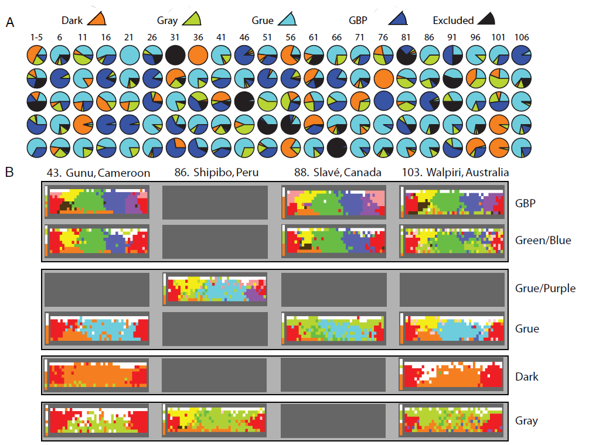

### Differences in human languages used to describe colour

* Show examples from WCS

### The concept of colour universals

[^1]

<figcaption>
Lindsay and Brown, "Within-language diversity in color naming. (A) Diversity in 110 WCS languages. Each pie chart represents one WCS language (numbers at the top) […] (B) Examples of WCS data from four languages; language numbers from A. The top two rows are the two K = 6 branches of the GBP (Green|Blue|Purple) motif; the second two rows are the two K = 5 branches of the Grue motif, both of which are united as single motifs at K = 4." 2009.
</figcaption>

  
* Walpiri language example.[^2]

### Colour in literature

![[example.experiment.color-timeline]]

- [ ] Include excerpts from *Gormenghast* about colour

[^1]: Wierzbicka, Anna. “Why There Are No ‘Colour Universals’ in Language and Thought.” *Journal of the Royal Anthropological Institute* 14, no. 2 (2008): 407–25. https://doi.org/10/d894bn.
[^2]: Lindsey, Delwin T., and Angela M. Brown. “World Color Survey Color Naming Reveals Universal Motifs and Their Within-Language Diversity.” *Proceedings of the National Academy of Sciences* 106, no. 47 (2009): 19785–90. https://doi.org/10/dv6nn5.
